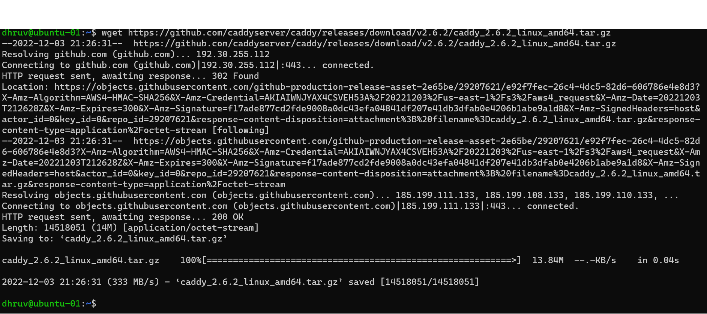

# 2420_AS2
<h2>STEP ONE: CREATING DO INFRASTRUCTURE</h2>

<h3>Step 1: Open Digital Ocean and create a new project</h3>
<h3>Step 2: Click on Networking and then VPC</h3>

<h3>Step 3: Choose your closest data centre, let DO generate an IP range for you, Name your VPC and then click on CREATE VPC NETWORK</h3>

<h3>Step 4: Go back to your project and Click on Get Started with a Droplet</h3>

<h3>Step 5: Select Ubuntu, choose your plan, Select the same data centre as your VPC, Select the VPC you just made, create two droplets and give them names, and then click Create Droplet</h3>

<h3>Step 6: Go back to Networking Section again and Click on Load Balancers</h3>

<h3>Step 7: Click on Create Load Balancers</h3>
<h3>Step 8: Choose the same data centre as your VPC and Select the VPC you created before</h3>

<h3>Step 9: Under Connect Droplets, select the two droplets you created before, and leave the other defaults as is. Then Click Create Load Balancer</h3>

<h3>Step 10: Now go back to Networking and Click on Firewalls and then Create Firewall</h3>

<h3>Step 11: Give it a suitable name and add HTTP under Inbound Rules. Under Inbound Rules, Delete default settings and Add your Load Balancer</h3>

<h3>Step 12: Under apply to Droplets, add the two droplets you created before and then  select Create Firewall</h3>

<b><h2>Your DO infrastructure is Complete</h2></b>

<h2>STEP TWO: CREATING REGULAR USERS IN DROPLETS</h2>
<h3>Step 1: SSH as root into one of your droplet</h3>
<h3>Step 2: Create a new user</h3> 
<pre><code>useradd -ms /bin/bash USERNAME</code></pre>

<h3>Step 3: Give this user root access</h3> 
<pre><code>usermod -aG sudo USERNAME</code></pre>

<h3>Step 4: Give this user a password</h3> 
<pre><code>passwd USERNAME</code></pre>

<h3>Step 5: Run this so only the user can login via ssh on your droplet</h3> 
<pre><code>rsync --archive --chown=USERNAME:USERNAME ~/.ssh /home/USERNAME</code></pre>
Now login to your regular user and run
<pre><code>sudo vi /etc/ssh/sshd_config</code></pre>

Change PermitRootLogin from yes to no

<h3>Step 6: Repeat the same steps with other droplet with same username and password for convienence</h3> 
<h2>Step Two is complete</h2>

<h2>STEP THREE: INSTALLING CADDY</h2>
<h3>Step:1Use this command to download the installation files for Caddy</h3>
<pre><code>wget https://github.com/caddyserver/caddy/releases/download/v2.6.2/caddy_2.6.2_linux_amd64.tar.gz</code></pre>

<h3>This will unarchive the installation files</h3>
<pre><code>tar xvf caddy_2.6.2_linux_amd64.tar.gz</code></pre>

<h3>Change Caddy file permission to root</h3>
<pre><code>sudo chown root: caddy</code></pre>

<h3>copy the Caddy file to /usr/bin/</h3>
<pre><code>    sudo cp caddy /usr/bin/</code></pre>

<h3>Update</h3>
<pre><code>Sudo apt update && sudo apt upgrade</code></pre>
Repeat this in your other droplet
<h2>You successfully install Caddy server</h2>

<h2>STEP FOUR: SETTING UP WSL</h2>
<h3>Step 1:Make a new directory and then make two directories named html and src inside this directory.</h3>

<h3>Step 2: Create a html file index.html inside the html folder and code it with HTML so it outputs "Hello World!"</h3>

<h3>Step 3: Go to https://volta.sh/ and install node using volta</h3>
<h3>Run this so linux knows where Volta is Installed</h3>
<pre><code>source ~/.bashrc</code></pre>

<h3>Step 4: Cd into src folder and run the following commands</h3>
<pre><code>npm init</code></pre>
<pre><code>npm i fastify</code></pre>
<h3>Step 5: Edit your index.js file and put the following code in it</h3>
<pre><code>// Require the framework and instantiate it
const fastify = require('fastify')({ logger: true })
const fs = require('fs')

// Declare a route
fastify.get('/api', async (request, reply) => {
          return { hello: 'Server X' }
})

// Run the server!
const start = async () => {
  try {
    await fastify.listen({ port: 5050 })
  } catch (err) {
    fastify.log.error(err)
    process.exit(1)
  }
}
start()

</code></pre>
<h3>This is a code for a basic Web server</h3>
<h3>Step 6: Run your server to test it</h3>
<pre><code>node index.js</code></pre>

<h3>Step : sftp your html and src directory to your droplets</h3>
<pre><code>node index.js</code></pre>

<h2>Step five: Writing caddy file on your WSL</h2>
<h3>Step:1 Create Caddy File</h3>
<pre><code>vim Caddyfile</code></pre>
<pre><code>http://[IP Address of your VPC] {
        root * /var/www
        reverse_proxy /api localhost:5050
        file_server
}</code></pre>
<h3>Step:2 Caddy Service File</h3>
<pre><code>vim caddy.service</code></pre>
<pre><code>[Unit]
Description=2420 Assignment 2
After=network.target

[Service]
Type=notify
ExecStart=/usr/bin/caddy run --environ --config /etc/caddy/Caddyfile
ExecReload=/usr/bin/caddy reload --config /etc/caddy/Caddyfile --force
TimeoutStopSec=5
KillMode=mixed

[Install]
WantedBy=multi-user.target
</code></pre>
<h2>Step Six: Installing Volta on Droplets</h2>
<h3>Step 1: Go to https://volta.sh/ and install node using volta</h3>
<h3>Run this so linux knows where Volta is Installed</h3>
<pre><code>source ~/.bashrc</code></pre>
<h3>Do this in both of your Droplet</h3>

<h2>Step Seven: Writing Service file to start your node application</h2>
<h3>Step 1: Create a new file</h3>
<pre><code>vim test_hello.services</code></pre>
<pre><code>[Unit]
Description=Service file for 2420
After=network.target

[Service]
User=dhruv
Group=dhruv
Type=notify
ExecStart=/home/dhruv/.volta/bin/node /home/dhruv/assignment/src/index.js
Restart=on-failure

[Install]
WantedBy=multi-user.target

</code></pre>
<h3>Replace dhruv with your username</h3>

<h2>Step Seven: Moving files into your droplet</h2>
<h3>Step 1: connect to the droplet via sftp</h3>
<pre><code>sftp dhruv@147.182.226.231</code></pre>
<h3>Move your caddy.service and Caddyfile to your droplets</h3>
<h3>Step 2: move your caddyfile and caddy.servive to appropriate location</h3>

<pre><code>sudo mkdir /etc/caddy
sudo mkdir /var/www

sudo cp Caddyfile /etc/caddy
sudo cp caddy.service /etc/systemd/system/caddy.service
sudo cp test_hello.service /etc/systemd/system/test_hello.service
sudo cp index.html /var/www/index.html</code></pre>
<h3>Enable and Start Caddy and your service file</h3>

<pre><code>systemctl enable caddy.service
systemctl start caddy.service

systemctl enable test_hello.service
systemctl start test_hello.service
</code></pre>

