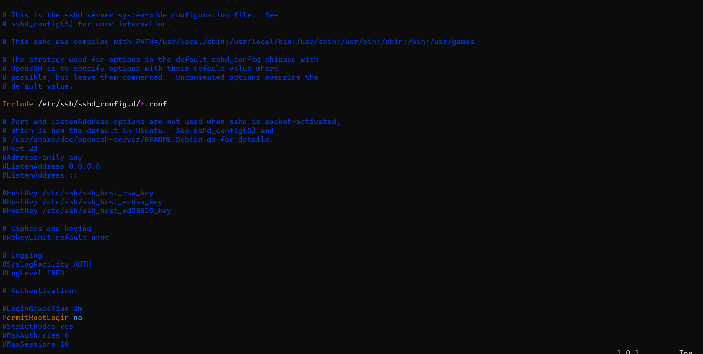

# 2420_AS2
<h2>STEP ONE: CREATING DO INFRASTRUCTURE</h2>

<h3>Step 1: Open Digital Ocean and create a new project</h3>
<h3>Step 2: Click on Networking and then VPC</h3>

<h3>Step 3: Choose your closest data centre, let DO generate an IP range for you, Name your VPC and then click on CREATE VPC NETWORK</h3>

<h3>Step 4: Go back to your project and Click on Get Started with a Droplet</h3>

<h3>Step 5: Select Ubuntu, choose your plan, Select the same data centre as your VPC, Select the VPC you just made, create two droplets and give them names, and then click Create Droplet</h3>

<h3>Step 6: Go back to Networking Section again and Click on Load Balancers</h3>

<h3>Step 7: Click on Create Load Balancers</h3>
<h3>Step 8: Choose the same data centre as your VPC and Select the VPC you created before</h3>

<h3>Step 9: Under Connect Droplets, select the two droplets you created before, and leave the other defaults as is. Then Click Create Load Balancer</h3>

<h3>Step 10: Now go back to Networking and Click on Firewalls and then Create Firewall</h3>

<h3>Step 11: Give it a suitable name and add HTTP under Inbound Rules. Under Inbound Rules, Delete default settings and Add your Load Balancer</h3>

<h3>Step 12: Under apply to Droplets, add the two droplets you created before and then  select Create Firewall</h3>

<b><h2>Your DO infrastructure is Complete</h2></b>

<h2>STEP TWO: CREATING REGULAR USERS IN DROPLETS</h2>
<h3>Step 1: SSH as root into one of your droplet</h3>
<h3>Step 2: Create a new user</h3> 
<pre><code>useradd -ms /bin/bash USERNAME</code></pre>

<h3>Step 3: Give this user root access</h3> 
<pre><code>usermod -aG sudo USERNAME</code></pre>

<h3>Step 4: Give this user a password</h3> 
<pre><code>passwd USERNAME</code></pre>

<h3>Step 5: Run this so only the user can login via ssh on your droplet</h3> 
<pre><code>rsync --archive --chown=USERNAME:USERNAME ~/.ssh /home/USERNAME</code></pre>
Now login to your regular user and run
<pre><code>sudo vi /etc/ssh/sshd_config</code></pre>

Change PermitRootLogin from yes to no

<h3>Step 6: Repeat the same steps with other droplet with same username and password for convienence</h3> 
<h2>Step Two is complete</h2>